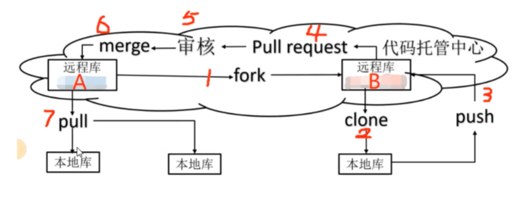

# Git

## 常用指令

```git
设置远程仓库位置
git remote rm origin
git remote add origin [url]

git add . 添加到暂存区

git commit -m ""  添加注释推送到本地仓库
git push origin master 将本地项目提交到服务器中
git push [远程仓库名][分支名] 将本地项目提交到某个分支


git branch -a 
git branch -r
git branch -v 查看分支
git branch [name] 创建一个新分支
git branch -d [name] 删除分支
git branch -m [oldname] [newname] 修改分支名
git checkout [name] 切换分支
git merge [name] 合并分支

git commit -am ""  直接提交git add 和git commit的合集,只能提交被跟踪的文件，如果是新建立的文件就不行了
git remote show origin 显示远程库origin里面的资源
git checkout --track origin/dev 切换到远程仓库的dev分支
git checkout -b dev 新建一个本地的dev分支
git checkout dev 切换到本地的dev分支
git merge origin/dev 将远程dev分支与当前分支合并

git rm [file name] 删除文件


git reflog 查看版本信息
git reset --hard [版本号] 切换版本信息

```

## 问题

1. 解决合并冲突问题
   当两个分支同时进行文件修改，git无法进行判断。

```
在主分支上再次进行修改，保留需要的内容后进行提交
```

2. 团队协作
   
   
